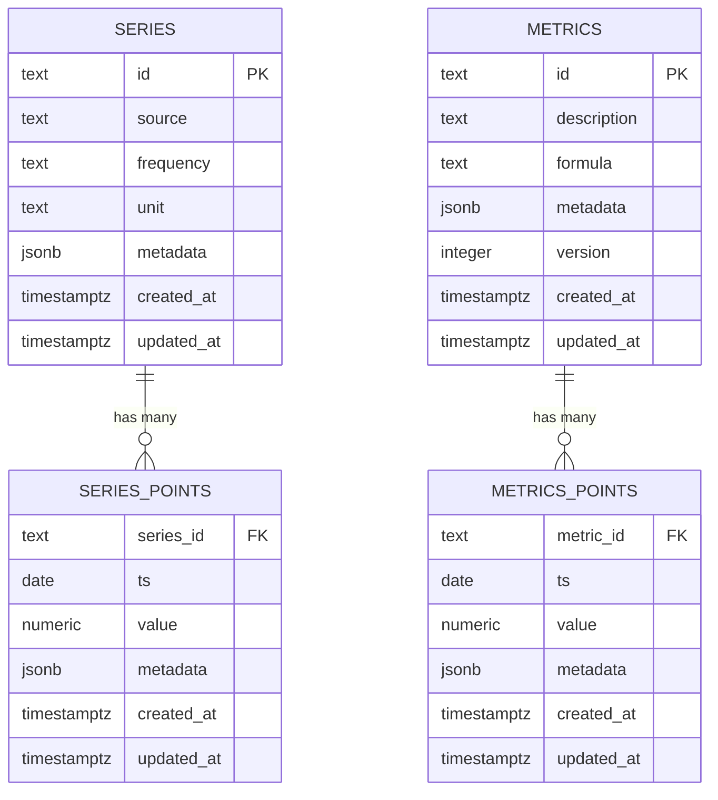

# Data Model Documentation

## Database Schemas Overview

The platform uses two PostgreSQL databases with distinct schemas for clear separation of concerns:

- **SOURCE Database** (`ingestor` @ localhost:5433): Raw time-series data
- **TARGET Database** (`metrics_engine` @ localhost:5434): Computed metrics and indicators

## Entity Relationship Diagram



## SOURCE Database Schema

### `series.series` - Series Catalog

**Purpose**: Master catalog of all tracked time-series from official sources.

| Column | Type | Nullable | Description | Example |
|--------|------|----------|-------------|---------|
| `id` | `TEXT` | ❌ | Canonical series identifier | `"1"`, `"bcra.usd_official_ars"` |
| `source` | `TEXT` | ❌ | Data provider | `"bcra"`, `"indec"`, `"dolarapi"` |
| `frequency` | `TEXT` | ❌ | Update frequency | `"daily"`, `"monthly"` |
| `unit` | `TEXT` | ❌ | Measurement unit | `"USD"`, `"ARS"`, `"ARS/USD"` |
| `metadata` | `JSONB` | ✅ | Provider-specific metadata | `{"bcra_idVariable": "1", "description": "..."}` |
| `created_at` | `TIMESTAMPTZ` | ❌ | Record creation timestamp | `2024-01-01T00:00:00Z` |
| `updated_at` | `TIMESTAMPTZ` | ❌ | Last update timestamp | `2024-01-01T00:00:00Z` |

**Primary Key**: `id`
**Indexes**: 
- `idx_series_source` on `source`
- `idx_series_frequency` on `frequency`

**Update Cadence**: Updated when new series are discovered or metadata changes

### `series.series_points` - Raw Time Series Data

**Purpose**: Individual data points for each time series.

| Column | Type | Nullable | Description | Example |
|--------|------|----------|-------------|---------|
| `series_id` | `TEXT` | ❌ | Foreign key to `series.id` | `"1"` |
| `ts` | `DATE` | ❌ | Series date (provider calendar) | `2024-01-15` |
| `value` | `NUMERIC` | ❌ | Numeric value as reported | `45000.50` |
| `metadata` | `JSONB` | ✅ | Provider trace information | `{"payload_ref": "abc123"}` |
| `created_at` | `TIMESTAMPTZ` | ❌ | Point creation timestamp | `2024-01-15T08:05:00Z` |
| `updated_at` | `TIMESTAMPTZ` | ❌ | Last update timestamp | `2024-01-15T08:05:00Z` |

**Primary Key**: `(series_id, ts)`
**Foreign Key**: `series_id` → `series.id`
**Indexes**:
- `idx_series_points_ts` on `ts`
- `idx_series_points_series_ts` on `(series_id, ts)`

**Update Cadence**: Daily ingestion at ~08:05 ART
**Data Retention**: Permanent (no automatic cleanup)

## TARGET Database Schema

### `metrics.metrics` - Metrics Catalog

**Purpose**: Catalog of computed metrics and their definitions.

| Column | Type | Nullable | Description | Example |
|--------|------|----------|-------------|---------|
| `id` | `TEXT` | ❌ | Metric identifier | `"ratio.reserves_to_base"` |
| `description` | `TEXT` | ❌ | Human-readable description | `"Reserves to Monetary Base Ratio"` |
| `formula` | `TEXT` | ❌ | Mathematical formula | `"reserves_usd / base_monetaria_ars"` |
| `metadata` | `JSONB` | ✅ | Metric metadata | `{"dependencies": ["1", "15"], "unit": "ratio"}` |
| `version` | `INTEGER` | ❌ | Formula version | `1` |
| `created_at` | `TIMESTAMPTZ` | ❌ | Metric creation timestamp | `2024-01-01T00:00:00Z` |
| `updated_at` | `TIMESTAMPTZ` | ❌ | Last update timestamp | `2024-01-01T00:00:00Z` |

**Primary Key**: `id`
**Indexes**: 
- `idx_metrics_version` on `version`

**Update Cadence**: Updated when metric definitions change
**Versioning**: Semantic versioning for formula revisions

### `metrics.metrics_points` - Computed Metrics Data

**Purpose**: Stored results of metric computations.

| Column | Type | Nullable | Description | Example |
|--------|------|----------|-------------|---------|
| `metric_id` | `TEXT` | ❌ | Foreign key to `metrics.id` | `"ratio.reserves_to_base"` |
| `ts` | `DATE` | ❌ | Metric date | `2024-01-15` |
| `value` | `NUMERIC` | ❌ | Computed metric value | `0.85` |
| `metadata` | `JSONB` | ✅ | Debug/audit information | `{"reserves": 45000, "base": 53000}` |
| `created_at` | `TIMESTAMPTZ` | ❌ | Point creation timestamp | `2024-01-15T08:15:00Z` |
| `updated_at` | `TIMESTAMPTZ` | ❌ | Last update timestamp | `2024-01-15T08:15:00Z` |

**Primary Key**: `(metric_id, ts)`
**Foreign Key**: `metric_id` → `metrics.id`
**Indexes**:
- `idx_metrics_points_ts` on `ts`
- `idx_metrics_points_metric_ts` on `(metric_id, ts)`

**Update Cadence**: Daily computation at ~08:15 ART
**Data Retention**: Permanent (Timescale hypertable for compression)

## Performance Considerations

### Indexing Strategy
- **Time-based queries**: Optimized with composite indexes on `(series_id, ts)` and `(metric_id, ts)`
- **Lookup queries**: Single-column indexes on frequently queried fields
- **Foreign keys**: Automatically indexed for join performance

### TimescaleDB Integration
- **Hypertables**: `metrics.metrics_points` is configured as a TimescaleDB hypertable
- **Compression**: Automatic compression for data older than 30 days
- **Retention**: Configurable data retention policies

### Query Optimization
- **Partitioning**: Time-based partitioning for large datasets
- **Statistics**: Regular `ANALYZE` operations for optimal query planning
- **Connection pooling**: Separate pools for source and target databases

## Data Quality Constraints

### Series Data
- **Uniqueness**: No duplicate `(series_id, ts)` combinations
- **Temporal ordering**: `ts` values must be valid dates
- **Value constraints**: `value` must be numeric and finite
- **Metadata validation**: JSONB structure validation

### Metrics Data
- **Referential integrity**: All `metric_id` values must exist in `metrics.metrics`
- **Temporal consistency**: `ts` values must align with source data availability
- **Value validation**: Computed values must be within expected ranges
- **Idempotency**: Safe to re-compute without data corruption

## Data Lineage Tracking

### Metadata Fields
- **Series points**: `metadata` contains provider trace information
- **Metrics points**: `metadata` contains input values and computation context
- **Audit trail**: `created_at` and `updated_at` timestamps for all records

### Provenance Chain
```
Official Source → Ingestor → series.series_points → Metrics Engine → metrics.metrics_points
```

Each step maintains metadata for full traceability and debugging capabilities.
