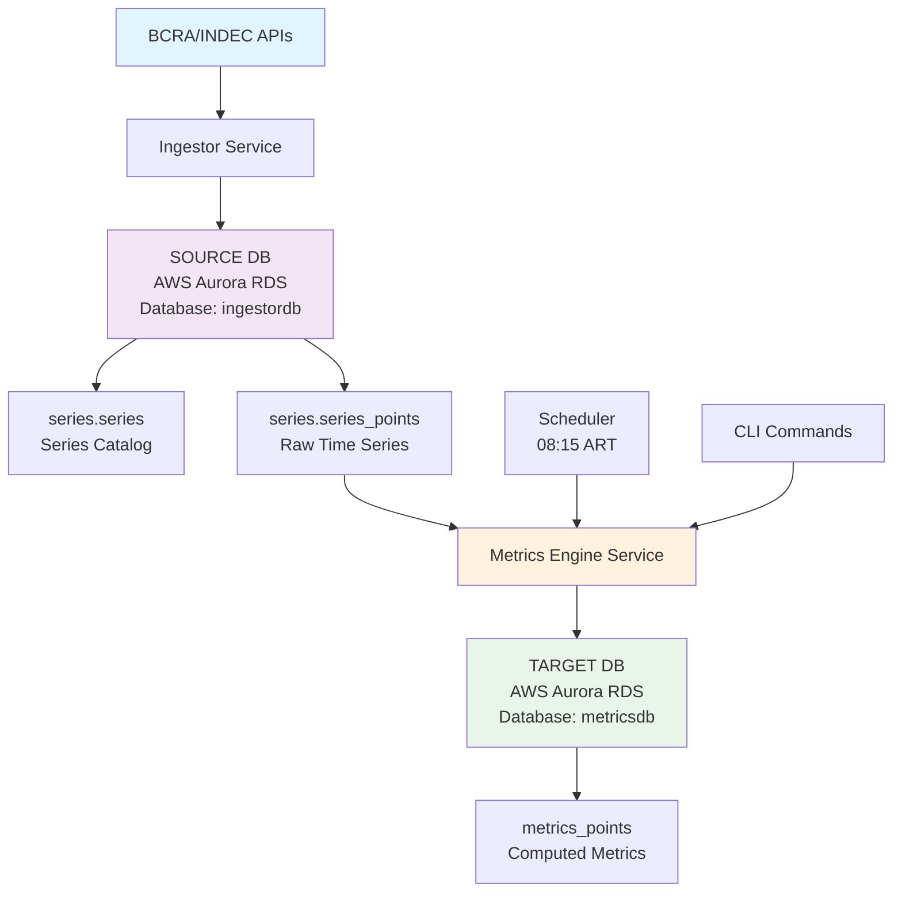
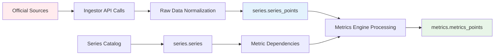

# Metrics Engine - Data Platform Overview

## Purpose

The Metrics Engine is a dual-database data platform that computes economic indicators from raw time-series data. It serves as the analytical layer that transforms raw financial data into actionable economic metrics for Argentina's financial markets.

## Architecture

The platform operates with two independent databases on AWS Aurora RDS:

- **SOURCE Database** (ingestordb): Contains raw time-series data from official sources
- **TARGET Database** (metricsdb): Stores computed metrics and derived indicators

## Data Flow

## Database Ownership

| Service | Database | Schema | Tables | Responsibility |
|---------|----------|--------|--------|----------------|
| **Ingestor** | `ingestordb` @ AWS Aurora | `series` | `series`, `series_points` | Raw data ingestion, series catalog |
| **Metrics Engine** | `metricsdb` @ AWS Aurora | `public` | `metrics_points` | Metric computation, derived indicators |

## Timezone Policy

- **Job Execution**: All scheduled jobs run in `America/Argentina/Buenos_Aires` timezone
- **Data Storage**: All timestamps are stored in UTC for consistency
- **Display**: User-facing interfaces convert to Argentina timezone for local interpretation

## Data Freshness & SLA

### Update Schedule
- **Raw Data Ingestion**: ~08:05 ART (Ingestor service)
- **Metrics Computation**: ~08:15 ART (Metrics Engine service)
- **Manual Triggers**: Available via CLI commands

### Expected Latency
- **Raw Data**: 10-15 minutes after official publication
- **Computed Metrics**: 5-10 minutes after raw data ingestion
- **Total End-to-End**: 15-25 minutes from official publication

### Fallback Behavior
- If primary provider (BCRA) fails, metrics computation may stall
- Historical data remains available for backfill operations
- Manual recomputation available for recent windows (default: 30 days)

## Service Boundaries

### Ingestor Service Responsibilities
- ✅ Fetch raw data from official sources (BCRA, INDEC)
- ✅ Normalize and store in `series` schema
- ✅ Maintain series catalog and metadata
- ❌ **Cannot** modify metrics-engine database

### Metrics Engine Service Responsibilities
- ✅ Read raw data from ingestor database (read-only)
- ✅ Compute derived metrics and indicators
- ✅ Store results in `metrics` schema
- ✅ Provide CLI tools for manual operations
- ❌ **Cannot** modify ingestor database

## Data Lineage

## Key Features

- **Idempotent Operations**: Safe to re-run computations without data corruption
- **Dual Database Architecture**: Clear separation between raw data and computed metrics
- **Comprehensive Logging**: Structured JSON logs for monitoring and debugging
- **CLI Interface**: Manual operations and troubleshooting tools
- **Health Monitoring**: Database connectivity and service status endpoints

## Getting Started

1. **Prerequisites**: Ensure both databases are running and accessible
2. **Configuration**: Set up environment variables (see `.env.example`)
3. **Initialization**: Run database migrations and seed data
4. **Verification**: Execute health checks and test CLI commands

For detailed setup instructions, see the main [README.md](../README.md).
